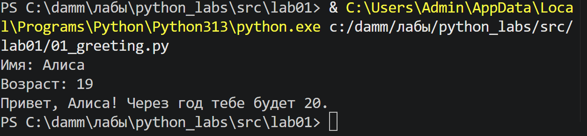
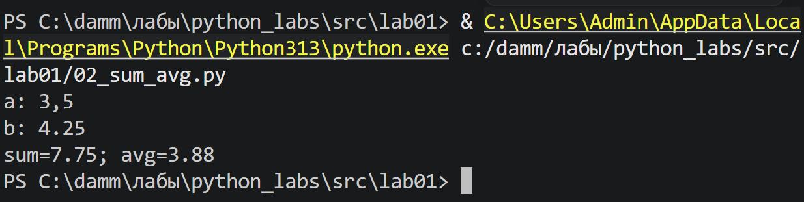
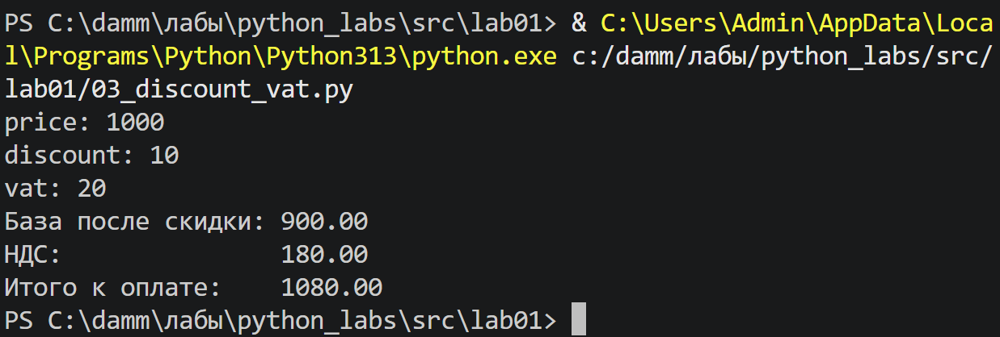
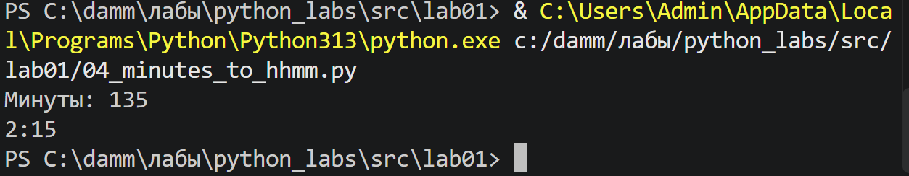
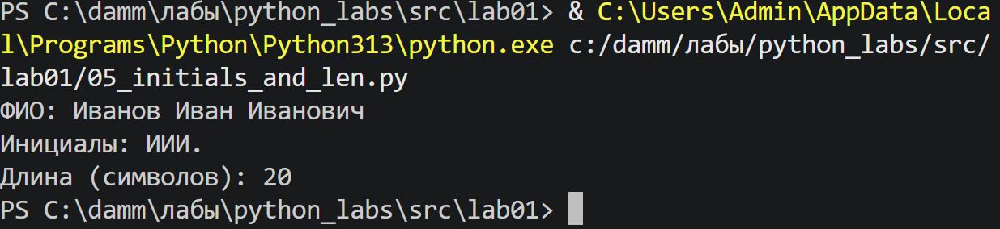
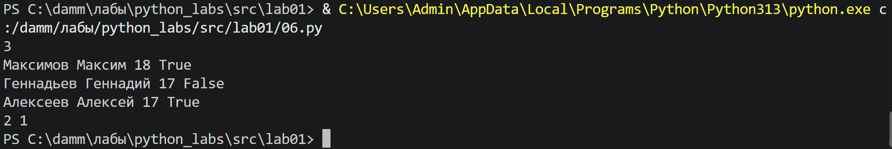

# ЛР1 — Ввод/вывод и форматирование

Цель работы — освоить чтение данных с клавиатуры, преобразование типов и оформление результатов вычислений. Каждый пункт реализован отдельным скриптом.

## Задание 1 — Приветствие и возраст

Код: [01_greeting.py](01_greeting.py).

Программа получает имя и возраст. Возраст переводится в целое число, увеличивается на единицу и подставляется вместе с именем в строку приветствия.

*Рисунок 1. Приветствие и возраст.*

## Задание 2 — Сумма и среднее

Код: [02_sum_avg.py](02_sum_avg.py).

Перед преобразованием в `float` запятая заменяется точкой, поэтому поддерживаются оба десятичных разделителя. Затем вычисляются сумма и среднее арифметическое. Формат `.2f` задаёт два знака после десятичной точки.

*Рисунок 2. Сумма и среднее.*

## Задание 3 — Стоимость со скидкой и НДС

Код: [03_discount_vat.py](03_discount_vat.py).

Сначала из исходной цены вычитается процент скидки. НДС рассчитывается от полученной базы, после чего прибавляется к ней. База, налог и итоговая сумма выводятся отдельными строками с двумя десятичными знаками.

*Рисунок 3. Стоимость со скидкой и НДС.*

## Задание 4 — Перевод минут в часы

Код: [04_minutes_to_hhmm.py](04_minutes_to_hhmm.py).

Целочисленное деление на 60 определяет количество полных часов. Остаток от деления — число оставшихся минут. Формат `02d` дополняет минуты ведущим нулём, например `125` минут превращаются в `2:05`.

*Рисунок 4. Перевод минут в часы.*

## Задание 5 — Инициалы и длина ФИО

Код: [05_initials_and_len.py](05_initials_and_len.py).

Метод `split()` разбивает ФИО на слова и убирает лишние пробелы. Первые буквы слов объединяются и переводятся в верхний регистр. Для подсчёта длины слова соединяются одним пробелом, затем используется `len()`.

*Рисунок 5. Инициалы и длина ФИО.*

## Задание 6* — Количество участников

Код: [06.py](06.py).

После ввода количества участников программа читает указанное число строк. Последнее поле каждой строки определяет, какой счётчик увеличить: очного или заочного участия. Значения `True` и `False`, полученные через `input()`, сравниваются как строки. Итог выводится двумя числами через пробел, сначала очный формат.

*Рисунок 6. Количество участников.*
