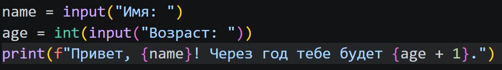
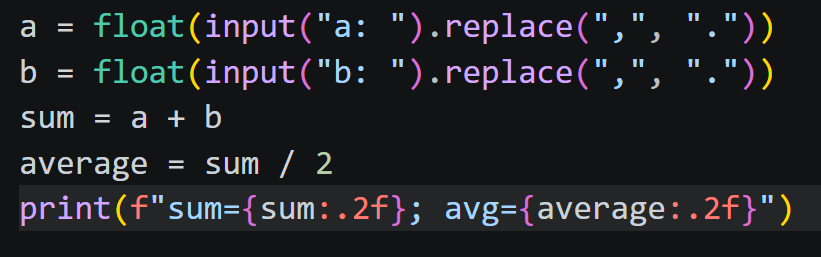
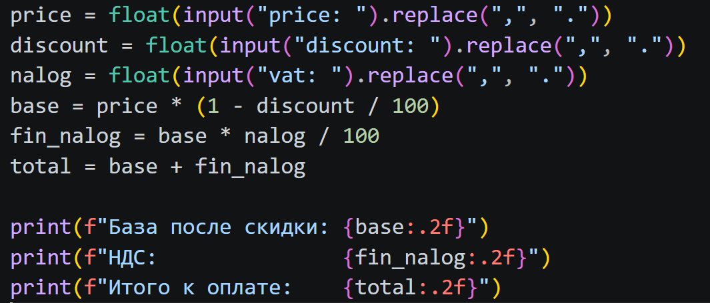
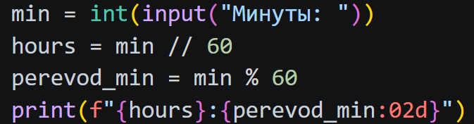
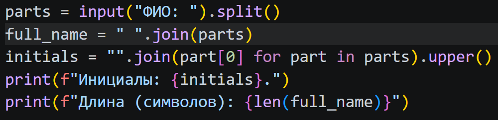

# ЛР1 — Ввод/вывод и форматирование

Цель работы — освоить чтение данных с клавиатуры, преобразование типов и оформление результатов вычислений. Каждый пункт реализован отдельным скриптом.

## Задание 1

Программа получает имя и возраст. Возраст переводится в целое число, увеличивается на единицу и подставляется вместе с именем в строку приветствия.

## Задание 2

Перед преобразованием в `float` запятая заменяется точкой, поэтому поддерживаются оба десятичных разделителя. Затем вычисляются сумма и среднее арифметическое. Формат `.2f` задаёт два знака после десятичной точки.

## Задание 3

Сначала из исходной цены вычитается процент скидки. НДС рассчитывается от полученной базы, после чего прибавляется к ней. База, налог и итоговая сумма выводятся отдельными строками с двумя десятичными знаками.

## Задание 4

Целочисленное деление на 60 определяет количество полных часов. Остаток от деления — число оставшихся минут. Формат `02d` дополняет минуты ведущим нулём, например `125` минут превращаются в `2:05`.

## Задание 5

Метод `split()` разбивает ФИО на слова и убирает лишние пробелы. Первые буквы слов объединяются и переводятся в верхний регистр. Для подсчёта длины слова соединяются одним пробелом, затем используется `len()`.

